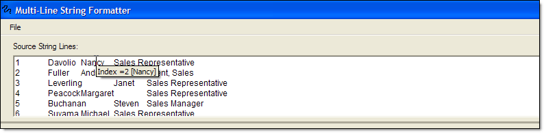
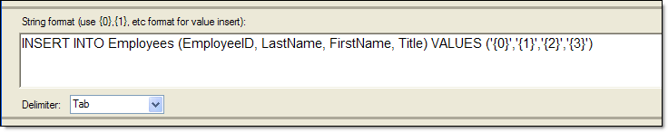
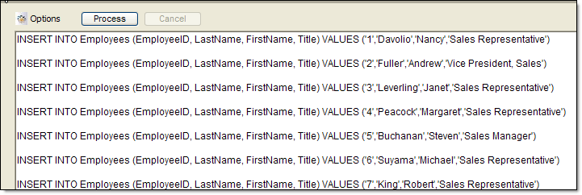
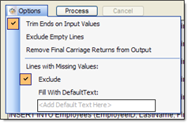

# Introduction
- Have you ever had some text data from a spreadsheet or database output or some other basic delimited file that you need to process into a set of SQL scripts to insert into a database?
- Have you ever needed to re-order columns of a pipe delimited file?
- Have you ever had to create new delimited file from another one?

If you answered yes to any of these, then you've probably tried using Excel or custom scripts and loops to do the processing for you, but now there is an easier way! With the Multi-Line String Formatter tool, you can easily manipulate delimited text files into any format you want. Here's how...

# Basic Usage for string manipulation

The screen consists of 3 sections, one each for the raw text input, the format definition and then the output.

## Top Section: Input Text
Simply paste in your text. It can be straight out of Excel, a Word table, a CSV, pipe delimited, etc. The text box will accept any format and keep all delimiters, including non-printable ones such as tabs. Once you define your delimiter (middle section) you can even click on any section of a line to easily display the index and the full value of the index that the cursor is placed at via a tool tip.

## Middle Section: Format Definition and Delimiter Setting
This section defines your output formatting. For you programmers out there, it uses the .NET String.Format methods under the hood, to the {0} tokens should be familiar. It's important to remember that the indexing starts at 0 (zero), not 1 (one) - but you can use the above technique to display the indexes for you just in case it's not clear (and some times with a tab delimited string, it can be pretty confusing.)
 
In this section, you also set the delimiter. You can use the pre-defined drop down selections or also type in your own custom delimiter. Finally, if you right-click in this section, you will be given to save your format definition so you can re-use it later!

## Bottom Section: Formatted Text Output

Once you have finished with the first 2 sections, you're ready to hit the "Process" button and let the tool run it's magic and output your newly formatted string. You can then right-click in the text box to either copy your output to the clipboard or save it to a new file.

 

## Processing options
In the options menu, you can specify how to add additional handling of the output. By default, the "Trim Ends on Input Values" and "Exclude" options are checked. These options will trim off extra end spaces from the input text and exclude lines that don't have enough indexes to fulfill the format processing respectively. You can also instruct the tool to exclude lines that are completely empty and also to remove carriage returns from the output (this will process your output into one long line. And finally, you can also instruct the tool to fill in those missing values with a pre-defined filler text.

 
