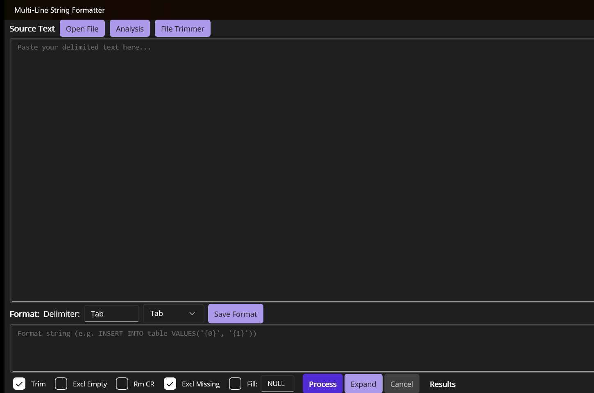

# Introduction

- Have you ever had some text data from a spreadsheet or database output or some other basic delimited file that you need to process into a set of SQL scripts to insert into a database?
- Have you ever needed to re-order columns of a pipe delimited file?
- Have you ever had to create new delimited file from another one?

If you answered yes to any of these, then you've probably tried using Excel or custom scripts and loops to do the processing for you, but now there is an easier way! With the Multi-Line String Formatter tool, you can easily manipulate delimited text files into any format you want. Here's how...



# Basic Usage for String Manipulation

The app is built with .NET MAUI for Windows and has a compact, single-window layout with all sections visible at once.

## Source Text (Top)

Simply paste in your text. It can be straight out of Excel, a Word table, a CSV, pipe delimited, etc. The text box will accept any format and keep all delimiters, including non-printable ones such as tabs. You can also click **Open File** to load text from a file. Click on any position in the source text to see the delimiter index and value in the status bar at the bottom.

## Format Definition (Middle)

This section defines your output formatting. It uses .NET `String.Format` under the hood, so `{0}`, `{1}`, etc. tokens are used to reference columns by index (starting at 0). Set the delimiter using the text box or pick a preset from the dropdown — you can also type in your own custom delimiter. Click **Save Format** to save your format string for reuse, and click any saved format to load it.

## Results (Bottom)

Hit the **Process** button and the tool will apply your format to every line. Right-click the results area to copy to clipboard or save to a file. Use **Expand** to reverse the process — turning formatted output back into delimited text.

## Processing Options

The options bar provides additional control over processing:

- **Trim** — Trims extra whitespace from input values (on by default)
- **Excl Empty** — Excludes completely empty lines
- **Rm CR** — Removes carriage returns, processing output into one long line
- **Excl Missing** — Excludes lines that don't have enough indexes for the format (on by default)
- **Fill** — Fills missing values with a default text (e.g. `NULL`)

## Additional Tools

- **Analysis** — Analyzes your source data showing line counts, index distribution, and lines with mismatched column counts
- **File Trimmer** — Extracts specific columns from a delimited file and writes them to a new file

# Building and Running

## Prerequisites

- [.NET 10 SDK](https://dotnet.microsoft.com/download) with the MAUI workload (`dotnet workload install maui-windows`)

## Run from Source

```bash
dotnet run --project src\MultiLineStringFormatter.Maui
```

## Publish Self-Contained

```powershell
.\publish.ps1
```

This produces a self-contained Windows x64 build in the `.\publish` folder. End users only need Windows 10 1809+ — no .NET SDK or runtime installation required.
